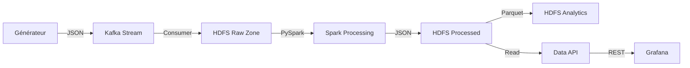

# Pipeline Big Data Smart City - Documentation Technique Détaillée

## Vue d'ensemble
Ce projet implémente un pipeline Big Data complet (End-to-End) pour l'analyse du trafic urbain dans le cadre des Smart Cities. Il simule des données de capteurs, les ingère en temps réel, les stocke, les traite pour en extraire des insights, et les visualise.

## Architecture Technique
Le pipeline suit une architecture Lambda simplifiée, traitant les données par batchs fréquents.

---

## Explication Détaillée du Code par Fichier

Cette section détaille le fonctionnement interne de chaque script du projet.

### 1. Orchestration (Airflow)
**Fichier :** `airflow_dags/pipeline_complet_etapes_1_7.py`

Ce fichier est le chef d'orchestre du pipeline. Il définit un **DAG (Directed Acyclic Graph)** Airflow qui exécute séquentiellement les 7 étapes du traitement.

*   **Structure du DAG** : 
    *   `generation_et_ingestion` : Lance en parallèle (via un script bash combiné) le générateur de données et le producteur Kafka. Cela simule une fenêtre de temps d'activité (ex: 60 secondes).
    *   `stockage_hdfs_raw` : Exécute le consumer Kafka qui vide le topic et écrit les fichiers JSON bruts dans HDFS (`/data/raw/traffic`).
    *   `traitement_spark` : Déclenche le job PySpark `traffic_processor.py` pour transformer les données brutes en métriques agrégées.
    *   `conversion_parquet` : Convertit les résultats JSON en format Parquet optimisé pour l'analyse historique.
    *   `validation_qualite` : Lance un script de vérification qui s'assure que chaque étape a produit les fichiers attendus.
    *   `export_metriques` : Une tâche finale qui signale la disponibilité des données pour l'API et Grafana.

### 2. Génération de Données
**Fichier :** `data_generator/traffic_data_generator.py`

Ce script simule l'activité d'une ville intelligente.
*   **Classe `TrafficDataGenerator`** :
    *   **Simulation de Capteurs** : Crée `N` capteurs virtuels, chacun associé à une zone (Centre-ville, Zone industrielle, etc.) et un type de route (Autoroute, Avenue, Rue).
    *   **Logique Métier (`_generate_realistic_metrics`)** : Calcule le nombre de véhicules, la vitesse et le taux d'occupation en fonction de l'heure de la journée (heures de pointe vs nuit).
    *   **Facteurs Réalistes** : Plus il y a de véhicules, plus la vitesse diminue et l'occupation augmente.
    *   **Format de Sortie** : Génère des événements JSON contenant `sensor_id`, `timestamp`, `metrics`.

### 3. Ingestion (Kafka Producer)
**Fichier :** `kafka_producer/kafka_producer_simple.py`

Responsable de l'envoi des données vers le bus de messages Kafka.
*   **Classe `SimpleKafkaProducer`** :
    *   Initialise une connexion au broker Kafka (port 29092 interne Docker).
    *   Sérialise les événements JSON en octets (bytes).
    *   Envoie les messages de manière asynchrone sur le topic `traffic-events`.
    *   Utilise la zone géographique comme **clé de partitionnement** (`key`), garantissant que les données d'une même zone restent ordonnées.

### 4. Stockage (Kafka Consumer & HDFS)
**Fichier :** `kafka_consumer/kafka_consumer_hdfs_rest.py`

Ce script agit comme un pont entre Kafka et le Data Lake (HDFS).
*   **Approche REST** : Au lieu d'utiliser un client HDFS natif binaire (souvent complexe à configurer), il utilise l'API **WebHDFS** via des requêtes HTTP (méthodes `PUT`, `GET`).
*   **Classe `HDFSRestClient`** : Encapsule les appels API pour créer des répertoires (`MKDIRS`) et créer des fichiers (`CREATE`).
*   **Logique de Consommation (`consume_kafka_to_hdfs`)** :
    *   Lit tous les messages disponibles dans Kafka depuis le début (`auto_offset_reset='earliest'`).
    *   Regroupe les messages par **Zone** et par **Date** pour structurer le Data Lake (partitionnement hiérarchique : `/zone/annee/mois/jour/`).
    *   Écrit les fichiers par batchs (ex: tous les 20 messages) pour éviter de créer trop de petits fichiers dans HDFS (problème des "small files").
    *   S'arrête automatiquement après un timeout si aucun nouveau message n'arrive, ce qui est adapté à un traitement batch déclenché par Airflow.

### 5. Traitement (Spark Processing)
**Fichier :** `spark_processing/traffic_processor.py`

Cœur analytique du projet, utilisant **PySpark** pour traiter les données distribuées.
*   **Classe `TrafficProcessor`** :
    *   Initialise une `SparkSession` locale.
    *   **Lecture** : Lit récursivement les JSON bruts depuis `/data/raw/traffic`.
    *   **Transformations** : Définit 4 types d'analyses principales :
        1.  `calculate_zone_metrics` : Moyennes par zone géographique (véhicules, vitesse).
        2.  `calculate_road_metrics` : Performance par type de route (autoroute vs rue).
        3.  `identify_congestion` : Détecte les zones où le taux d'occupation dépasse 70% (`threshold=0.7`).
        4.  `calculate_hourly_patterns` : Analyse temporelle pour voir l'évolution trafic par heure.
    *   **Écriture** : Sauvegarde les résultats calculés dans `/data/processed/traffic` au format JSON pour être facilement lisibles par l'API.

### 6. Optimisation Analytics
**Fichier :** `analytics/parquet_converter.py`

Optimise le stockage pour des analyses futures ou des requêtes performantes.
*   **Objectif** : Convertir les résultats JSON (verbeux, lent) en **Parquet** (binaire, colonnaire, compressé).
*   **Avantages du Parquet** expliqués dans le code : compression Snappy (réduction de taille), lecture rapide (on ne lit que les colonnes nécessaires), typage fort.
*   Le script prend les données de `/data/processed` et les écrit dans `/data/analytics` au format Parquet.

### 7. Validation Qualité
**Fichier :** `scripts/validate_data_quality.py`

Assure la robustesse du pipeline.
*   **Classe `DataQualityValidator`** :
    *   Vérifie l'existence et le contenu non-vide des répertoires clés dans HDFS via WebHDFS.
    *   Valide les 3 zones du Data Lake :
        *   **Raw Zone** : Vérifie que les données brutes sont bien arrivées.
        *   **Processed Zone** : Vérifie que Spark a bien généré les 4 types de métriques.
        *   **Analytics Zone** : Vérifie que la conversion Parquet a réussi.
    *   Sert de "Quality Gate" : si ce script échoue, le DAG Airflow est marqué en échec.

### 8. API de Visualisation
**Fichier :** `api/data_api.py`

Expose les données stockées dans HDFS au monde extérieur (Grafana).
*   **Framework Flask** : Crée un serveur web léger.
*   **Endpoints REST** :
    *   `/api/zone-metrics`, `/api/road-metrics`, etc. : Lisent les fichiers JSON générés par Spark directement depuis HDFS via WebHDFS et les renvoient en JSON standard.
    *   `/api/kpis` : Calcule des agrégats globaux à la volée (Vitesse moyenne globale, zone la plus congestionnée) pour les affichages "Single Stat" de Grafana.
    *   `/api/query` : Endpoint spécifique compatible avec le plugin "SimpleJson" de Grafana pour permettre des requêtes dynamiques.

---

## Infrastructure (Docker)
**Fichier :** `docker-compose.yml`

Définit l'environnement complet conteneurisé.
*   **Services Core** :
    *   `zookeeper` & `kafka` : Bus de messages.
    *   `namenode` & `datanode` : Cluster HDFS (Hadoop Distributed File System).
*   **Orchestration** :
    *   `postgres` : Base de données de métadonnées pour Airflow.
    *   `airflow-webserver` & `scheduler` : Interface et moteur d'exécution Airflow.
*   **Visualisation** :
    *   `grafana` : Tableaux de bord.
    *   `data-api` : Notre API Python customisée (voir point 8).

## Comment Lancer
1. **Démarrer l'infrastructure** : `docker-compose up -d`
2. **Accéder à Airflow** : `http://localhost:8081` (user/pass: airflow)
3. **Lancer le DAG** : Activez et déclenchez `pipeline_complet_etapes_1_7`.
4. **Voir les résultats** :
    *   API : `http://localhost:5000/api/kpis`
    *   Grafana : `http://localhost:3000`
